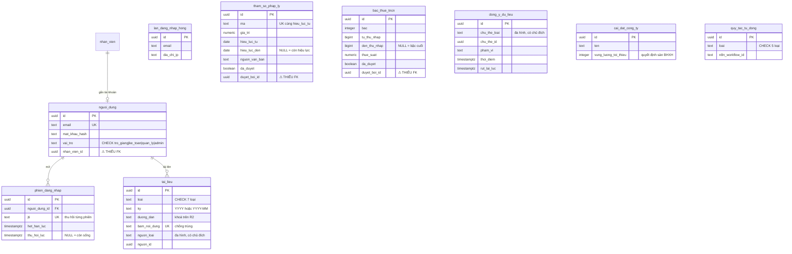
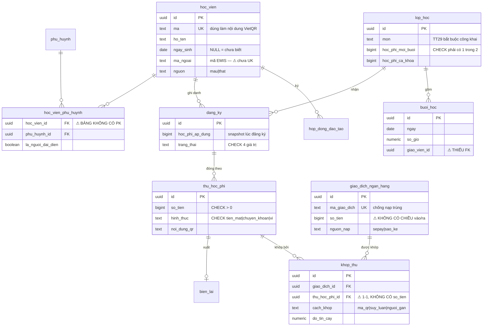
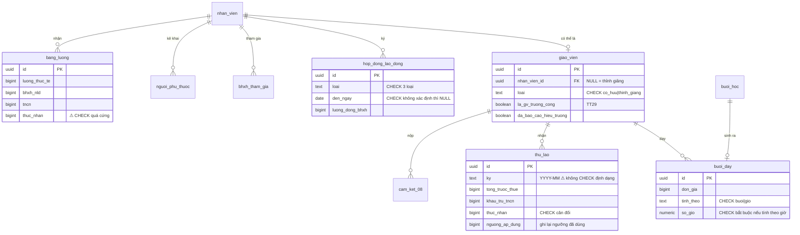
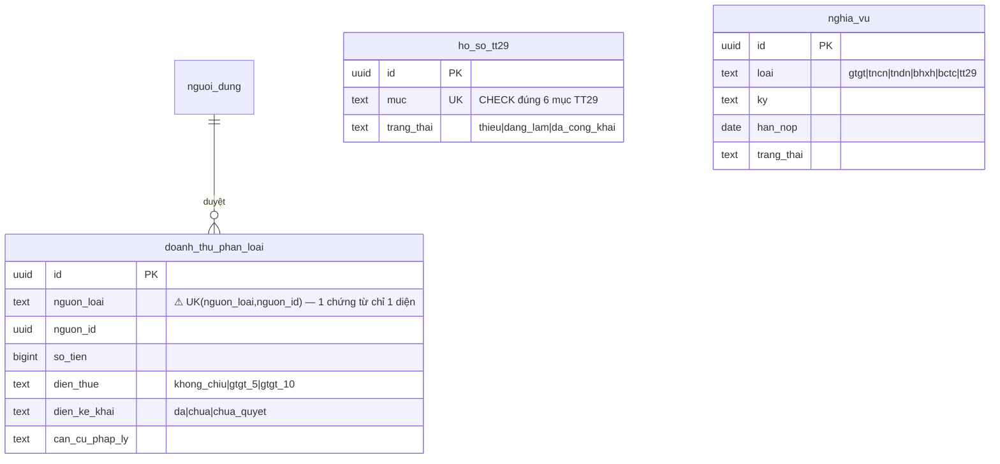

# ERD — ANSER-HSA

> Rà soát ngày 10/08/2026 · 32 bảng đang chạy thật trên Neon (migration `0000`–`0002`)
> Soi từ **lược đồ thật trong DB**, không đọc lại file nguồn — file là ý định, DB là sự thật.

Tài liệu này có ba phần: sơ đồ theo bốn mảng nghiệp vụ · **mười một vấn đề tìm được**,
xếp theo mức · và những bảng còn thiếu. Mỗi vấn đề kèm *"không sửa thì hỏng ở đâu"*,
viết rời để bác được từng điểm.

**Kết quả soi tự động:**

```
32 bảng · 23 khoá ngoại · 50 chỉ mục · 53 ràng buộc CHECK
1 bảng không có khoá chính
4 cột *_id không có khoá ngoại (ngoài 3 cột đa hình có chủ đích)
```

---

## 1. Sơ đồ — bốn mảng

### 1.1. Nền tảng



### 1.2. Học viên và tiền vào



### 1.3. Nhân sự và tiền ra



### 1.4. Thuế và hồ sơ



---

## 2. Mười một vấn đề

### Mức A — sai mô hình, sửa sau là mất dữ liệu

#### A1. `khop_thu` là 1–1 và không có số tiền phân bổ

Thực tế có hai tình huống thường xuyên mà mô hình hiện tại không chứa nổi:

- **Một chuyển khoản trả cho hai con.** Phụ huynh chuyển 6 triệu cho hai học viên.
  Một `giao_dich_ngan_hang`, hai `thu_hoc_phi`.
- **Một khoản học phí đóng làm ba lần.** Ba giao dịch, một `thu_hoc_phi`.

Bảng hiện có `giao_dich_id` và `thu_hoc_phi_id` nhưng **không có `so_tien`**, nên không
diễn tả được "giao dịch này trả 3 triệu cho khoản A, 3 triệu cho khoản B".

> **Không sửa thì hỏng ở đâu:** `khop_hoc_phi` là tool xếp hạng 1 về số giờ tiết kiệm.
> Nó sẽ khớp được đúng những ca dễ nhất và bó tay ở ca thường gặp nhất của một trung
> tâm có anh chị em học cùng. Người dùng quay lại Excel.

**Đề xuất:** `khop_thu` thành bảng **phân bổ**, thêm `so_tien` và ràng buộc tổng phân bổ
của một giao dịch không vượt số tiền giao dịch.

#### A2. Một chứng từ chỉ được gắn một diện thuế

`unique(nguon_loai, nguon_id)` trên `doanh_thu_phan_loai` khoá mỗi chứng từ vào đúng
một diện. Nhưng một phiếu thu có thể gồm **học phí (không chịu thuế) + bán tài liệu
(chịu 10%)** — đúng ranh giới mục 2.2 của chiến lược, và đúng chỗ *"nhiều trung tâm
khai nhầm"*.

> **Không sửa thì hỏng ở đâu:** buộc kế toán chọn một diện cho cả phiếu. Chọn "không
> chịu thuế" là khai thiếu; chọn "10%" là nộp thừa. Cả hai đều sai và không ai thấy.

#### A3. `giao_dich_ngan_hang.so_tien` không có chiều vào/ra

Sao kê ngân hàng có cả tiền vào lẫn tiền ra. Bảng hiện chỉ có một cột số tiền dương,
không phân biệt được. Đây đúng là bài học **B1 của `ERD_CHUAN.md`** — *"quantity có
dấu"* — mà lần này quên áp.

> **Không sửa thì hỏng ở đâu:** nạp một tháng sao kê xong, tổng tiền vào bằng tổng
> mọi dòng, gồm cả các khoản chi. Doanh thu bị thổi phồng bằng đúng số tiền đã chi ra.

#### A4. `thu_lao` không nối được về `buoi_day`

Có bảng thù lao theo kỳ, có bảng buổi dạy, nhưng **không có gì nói bảng thù lao này
gồm những buổi nào**.

> **Không sửa thì hỏng ở đâu:** vi phạm thẳng lời hứa trung tâm của sản phẩm — *"mọi
> con số truy được về chứng từ"*. Giáo viên hỏi "sao tháng này em được có ngần này",
> không ai mở ra được danh sách buổi.

---

### Mức B — thiếu khái niệm, thêm sau thì đau

#### B1. Chưa có sổ thu chi

Chưa có `khoan_thu` / `khoan_chi`. Không có chi phí thì không ra được lãi lỗ — mà
*"chủ trung tâm thấy lãi thật"* là giá trị chính của mục 1.

#### B2. Không có khoá kỳ kế toán

Nộp tờ khai tháng 6 xong, ai đó sửa một dòng doanh thu tháng 6 thì số trong hệ thống
không còn khớp tờ khai đã nộp, và **không có gì báo**.

> Với sản phẩm chạy hai sổ, đây là lỗ hổng nghiêm trọng: phần chênh giữa sổ quản trị và
> sổ thuế chỉ có nghĩa khi biết nó được chốt ở thời điểm nào.

**Đề xuất:** `ky_ke_toan(ky, trang_thai, khoa_luc, khoa_boi_id)` và chặn ghi vào kỳ đã khoá.

#### B3. Không có nhật ký thay đổi

Sửa một dòng doanh thu hôm nay thì không ai biết ai sửa, sửa từ gì sang gì, lúc nào.

> Lời hứa "truy được về chứng từ" mới chỉ đúng theo chiều *bản ghi → chứng từ gốc*, chưa
> đúng theo chiều *con số hôm nay → nó từng là gì*. Với hai sổ, chiều thứ hai mới là
> chiều người ta hỏi khi có chuyện.

#### B4. Chi phí chưa có khái niệm "được trừ"

Song song với `dien_ke_khai` bên doanh thu, chi phí có khái niệm **chi phí được trừ khi
tính thuế TNDN**: không hoá đơn hợp lệ thì không được trừ. Chưa có chỗ ghi.

#### B5. Quyền xoá dữ liệu cá nhân đụng lưu trữ chứng từ

Luật 91/2025 cho cá nhân quyền yêu cầu xoá. Nhưng xoá `hoc_vien` sẽ cascade sang
`dang_ky`, mà `thu_hoc_phi` để `restrict` — nên lệnh xoá **fail**, và không có đường
nào thực hiện quyền đó.

Hai nghĩa vụ mâu thuẫn thật: luật dữ liệu bảo xoá, luật kế toán bảo giữ chứng từ.

**Đề xuất:** **ẩn danh hoá** thay vì xoá — giữ nguyên bản ghi tài chính, thay tên/SĐT/
ngày sinh bằng mã, ghi `an_danh_luc`. Số liệu kế toán còn nguyên, dữ liệu cá nhân biến mất.

---

### Mức C — sửa nhanh, không tranh cãi

| # | Vấn đề | Sửa |
|---|---|---|
| C1 | `hoc_vien_phu_huynh` **không có khoá chính** | PK ghép `(hoc_vien_id, phu_huynh_id)` |
| C2 | 4 cột `*_id` thiếu khoá ngoại: `nguoi_dung.nhan_vien_id`, `buoi_hoc.giao_vien_id`, hai cột `duyet_boi_id` | thêm FK |
| C3 | `ky` dạng text không có CHECK định dạng | `CHECK ky ~ '^\d{4}-\d{2}$'` |
| C4 | `hoc_vien.ma_ngoai` chưa UNIQUE | đồng bộ EMIS hai lần sẽ tạo học viên trùng |
| C5 | `bang_luong` CHECK cân đối quá cứng | chưa có chỗ cho phụ cấp, thưởng, khấu trừ khác |
| C6 | Chưa có chỉ mục cho cột lọc thường dùng (`ky`, `ngay`, `nguon_loai`) | chưa đau ở quy mô pilot, nhưng rẻ |

Ba cột đa hình **không** phải lỗi và cố ý không có FK: `tai_lieu.nguon_id`,
`doanh_thu_phan_loai.nguon_id`, `dong_y_du_lieu.chu_the_id` — đúng bài học 4 của
`ERD_CHUAN.md`, đi kèm CHECK ràng cặp `nguon_loai`/`nguon_id` cùng có hoặc cùng NULL.

---

## 3. Bảng đề xuất thêm

```
khoan_thu · khoan_chi          sổ thu chi (GĐ2)
ky_ke_toan                     khoá kỳ đã nộp (B2)
nhat_ky_thay_doi               append-only, ai sửa gì lúc nào (B3)
```

---

## 4. Thứ tự sửa đề xuất

| Đợt | Việc | Vì sao trước |
|---|---|---|
| **1** | C1–C4 + A3 (chiều giao dịch) | Chưa có dữ liệu thật, sửa bây giờ không mất gì |
| **2** | A1 (phân bổ khớp thu), A2 (phân loại mức dòng), A4 (nối thù lao ↔ buổi dạy) | Sửa trước khi tool tương ứng được viết |
| **3** | B1 sổ thu chi + B4 chi phí được trừ | Chính là GĐ2 |
| **4** | B2 khoá kỳ + B3 nhật ký | Trước khi khách nhập dữ liệu thật |
| **5** | B5 ẩn danh hoá | Trước khi có học viên thật trong hệ thống |

Đợt 1 và 2 nên gộp làm một migration: **hiện chưa có một dòng dữ liệu nghiệp vụ nào
trong DB**, nên đây là thời điểm rẻ nhất để sửa mô hình. Mỗi ngày trôi qua sau khi
khách bắt đầu nhập, giá của mỗi thay đổi ở mục A tăng lên.
